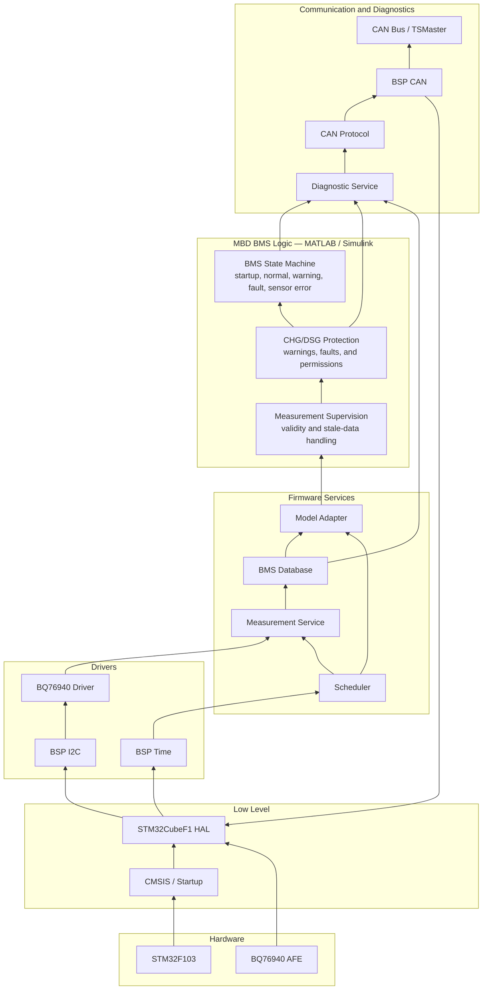

# STM32 BMS

A battery management system prototype for an STM32F103 and BQ76940-based
board. It measures cell voltages, validates measurement health, evaluates
charge/discharge protection, manages the BMS operating state, and reports the
result over CAN.

The required end-to-end path is:

```text
Cell input
  → BQ76940 driver
  → validated measurement
  → MBD protection and state logic
  → CAN diagnostics
  → TSMaster
```

The initial system operates in **shadow mode**: it measures, evaluates, and
reports warnings, faults, and CHG/DSG permissions without controlling the
MOSFETs. It is an engineering prototype, not a production-ready or
safety-certified BMS.

## Tech Stack

| Layer | Technology | Purpose |
|---|---|---|
| Hardware | STM32F103, BQ76940 | Processing and cell measurement |
| Platform | CMSIS, STM32CubeF1 HAL | Startup, GPIO, I2C, CAN, timers |
| Drivers | Board Support Package (BSP), BQ76940 driver | Isolate hardware and decode AFE data |
| Services | Scheduler, measurement, diagnostics | Validate data and coordinate tasks |
| Application | MATLAB/Simulink, generated C | BMS states, warnings, faults, hysteresis |
| Communication | CAN, TSMaster | Report measurements and model state |
| Build | CMake, Ninja, Arm GNU Toolchain | Configure and compile firmware |

```text
BQ76940 → HAL → BSP → Driver → Services → MBD Logic → CAN → TSMaster
```

## Overview


