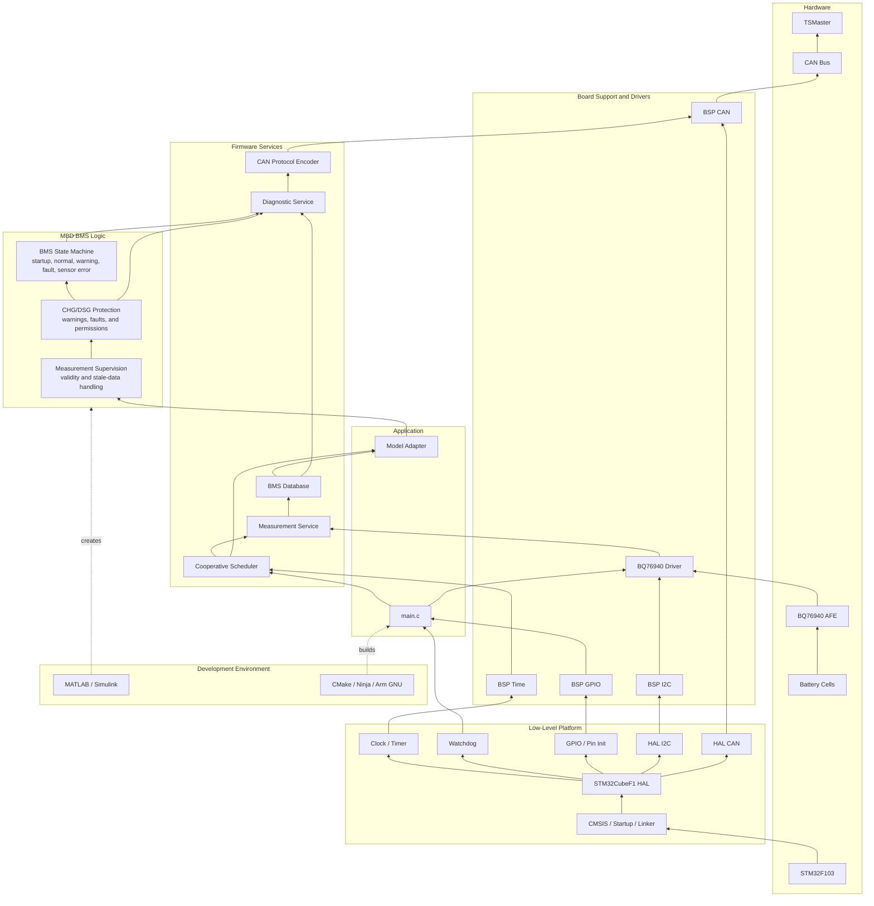

# STM32 BMS

A battery management system prototype for an STM32F103 and BQ76940-based
board. It measures cell voltages, validates measurement health, evaluates
charge/discharge protection, manages the BMS operating state, and reports the
result over CAN.

The required end-to-end path is:

```text
Cell input
  → BQ76940 driver
  → validated measurement
  → MBD protection and state logic
  → CAN diagnostics
  → TSMaster
```

The initial system operates in **shadow mode**: it measures, evaluates, and
reports warnings, faults, and CHG/DSG permissions without controlling the
MOSFETs. It is an engineering prototype, not a production-ready or
safety-certified BMS.

## Verified Platform Baseline

The Day 1-2 platform milestone has been validated on the physical board. The
firmware boots from Flash, configures the external clock, runs the HAL SysTick
time base, and toggles the active-low status LED on PB14 every 500 ms.

### Hardware configuration

| Item | Verified configuration |
|---|---|
| MCU | STM32F103C8T6, Arm Cortex-M3, LQFP48 |
| Maximum/system clock | 72 MHz |
| External oscillator | 8 MHz HSE crystal |
| SRAM | 20 KiB |
| Physical Flash | 64 KiB |
| Application Flash | 63 KiB at `0x08000000` |
| Reserved configuration page | 1 KiB at `0x0800FC00` |
| Debug interface | J-Link SWD: PA13/SWDIO and PA14/SWCLK |
| Board status LED | PB14, active-low |
| Battery monitor | BQ76940 |
| Planned AFE bus | I2C1: PB6/SCL and PB7/SDA; PB8/ALERT |
| Planned CAN pins | CAN1: PA11/RX and PA12/TX |

The canonical STM32 configuration is stored in
[`stm32-mbd-bms.ioc`](stm32-mbd-bms.ioc).

### Verified development environment

These are the versions used for the current hardware-validated baseline, not
minimum version requirements unless stated otherwise.

| Tool or package | Verified version |
|---|---|
| STM32CubeMX | 6.18.1 |
| STM32CubeMX database | DB.6.0.181 |
| STM32CubeF1 | 1.8.7 |
| STM32F1 HAL | 1.1.10 |
| Arm GNU Toolchain | 15.3.Rel1 / GCC 15.3.1 |
| CMake | 4.3.2; project minimum is 3.22 |
| Ninja | 1.13.2 |
| SEGGER J-Link Software | 9.60 |

### Build

From the repository root:

```powershell
cmake --preset Debug --fresh
cmake --build --preset Debug
```

The build creates:

```text
build/Debug/stm32-mbd-bms.elf
build/Debug/stm32-mbd-bms.hex
build/Debug/stm32-mbd-bms.bin
build/Debug/stm32-mbd-bms.map
```

### Flash with J-Link

With the board powered and J-Link connected to VTref, GND, SWDIO, and SWCLK:

```powershell
& "C:\Program Files\SEGGER\JLink_V960\JLink.exe" `
  -CommanderScript "scripts\flash.jlink"
```

The current smoke-test firmware blinks the PB14 status LED with a one-second
period.

### Third-party software and licenses

The repository vendors the CMSIS and STM32CubeF1 HAL sources needed for an
offline, reproducible build. Their upstream licenses remain applicable; the
repository's top-level `LICENSE` does not replace them.

- STM32CubeF1 package license and SBOM are retained under
  [`vendor/STM32CubeF1`](vendor/STM32CubeF1).
- CMSIS is provided under Apache-2.0; its license is retained with the CMSIS
  sources.
- The STM32F1 HAL is provided under BSD-3-Clause; its license is retained with
  the HAL sources.
- Do not remove vendor copyright headers or license files when updating the
  STM32CubeF1 package.

## Tech Stack
```
┌──────────────────────────────────────────────────┐
│ Application                                      │
│ BMS state, warnings, faults, diagnostics         │
│ Simulink-generated logic                         │
├──────────────────────────────────────────────────┤
│ Services                                         │
│ Measurement database, scheduler, event handling  │
├──────────────────────────────────────────────────┤
│ Device and protocol drivers                      │
│ BQ76940, CAN protocol, optional RS485            │
├──────────────────────────────────────────────────┤
│ Board-support package                            │
│ I2C, CAN, GPIO, time, watchdog                   │
├──────────────────────────────────────────────────┤
│ Platform                                         │
│ STM32CubeF1 HAL, CMSIS, startup, linker          │
├──────────────────────────────────────────────────┤
│ Hardware                                         │
│ STM32F103 + BQ76940 + transceivers + board IO    │
└──────────────────────────────────────────────────┘
```

| Layer | Technology | Purpose |
|---|---|---|
| Hardware | STM32F103, BQ76940 | Processing and cell measurement |
| Platform | CMSIS, STM32CubeF1 HAL | Startup, GPIO, I2C, CAN, timers |
| Drivers | Board Support Package (BSP), BQ76940 driver | Isolate hardware and decode AFE data |
| Services | Scheduler, measurement, diagnostics | Validate data and coordinate tasks |
| Application | MATLAB/Simulink, generated C | BMS states, warnings, faults, hysteresis |
| Communication | CAN, TSMaster | Report measurements and model state |
| Build | CMake, Ninja, Arm GNU Toolchain | Configure and compile firmware |

```text
BQ76940 → HAL → BSP → Driver → Services → MBD Logic → CAN → TSMaster
```

## Overview


